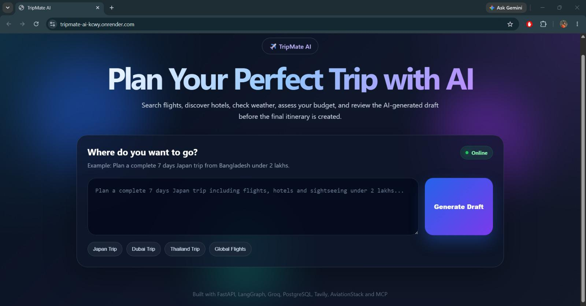
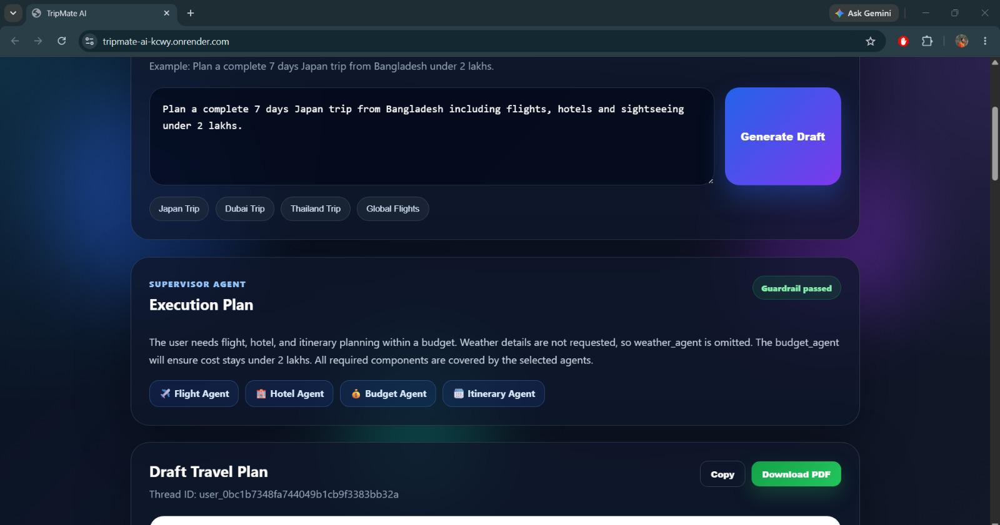
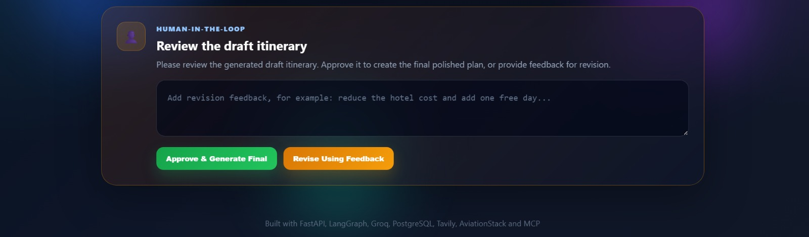

# ✈️ TripMate AI

**A governed multi-agent travel planner** — built with LangGraph, MCP, and a Supervisor architecture that keeps a human in the loop before any final plan goes out.

Tell it where you want to go, and it coordinates a team of specialist AI agents — flights, hotels, weather, budget — into one draft itinerary. Nothing gets finalized without your review and approval first.

🔗  **Live Demo:** [https://tripmate-ai-kcwy.onrender.com/](https://tripmate-ai-kcwy.onrender.com/)

---

## TripMate AI important featues :

- **A Supervisor agent** decides which specialists are even needed for a given request, instead of blindly running everything every time.
- **Input guardrails** check that a request is actually travel-related before any agent work begins — rejecting off-topic or unsafe prompts early.
- **Human-in-the-Loop (HITL) approval** pauses the pipeline after a draft itinerary is generated. You review it, approve it, or send it back with feedback — and only then does the system generate the final, polished plan.
- **Stateful conversations** — powered by PostgreSQL checkpointing via LangGraph, so a paused thread waiting on your approval can be resumed at any time, even after a server restart.

---

## Architecture

```
                          ┌─────────────┐
                          │   User      │
                          │   Request   │
                          └──────┬──────┘
                                 │
                          ┌──────▼──────┐
                          │  Guardrail  │───▶ Blocked (off-topic/unsafe)
                          │  Check      │
                          └──────┬──────┘
                                 │ allowed
                          ┌──────▼──────┐
                          │ Supervisor  │  ← decides which agents to run
                          │   Agent     │
                          └──────┬──────┘
                                 │
          ┌──────────┬──────────┼──────────┬──────────┐
          ▼          ▼          ▼          ▼          ▼
      ┌───────┐  ┌───────┐  ┌────────┐  ┌────────┐  ┌───────────┐
      │Flight │  │Hotel  │  │Weather │  │Budget  │  │ Itinerary │
      │Agent  │  │Agent  │  │Agent   │  │Agent   │  │  Agent    │
      └───┬───┘  └───┬───┘  └───┬────┘  └───┬────┘  └─────┬─────┘
          └──────────┴──────────┴───────────┴─────────────┘
                                 │
                          ┌──────▼──────┐
                          │   Human     │  ← draft itinerary paused here
                          │  Approval   │     (interrupt + resume via
                          │   (HITL)    │      Postgres checkpoint)
                          └──────┬──────┘
                                 │ approved / feedback
                          ┌──────▼──────┐
                          │   Final     │
                          │   Agent     │  → polished, final itinerary
                          └─────────────┘
```

Each specialist agent calls out to real data sources through **MCP (Model Context Protocol)** adapters — Tavily for hotel search, OpenWeather for live weather, AviationStack for flight/airport data — rather than relying purely on the LLM's own knowledge.

---

## Tech Stack

| Layer | Technology |
|---|---|
| Agent orchestration | LangGraph, LangChain |
| LLM inference | Groq (`openai/gpt-oss-20b`) |
| Tool integration | MCP (Model Context Protocol) |
| Backend / API | FastAPI, Python |
| State persistence | PostgreSQL (LangGraph checkpointing) |
| Frontend | HTML, vanilla JS, Jinja2 templates |
| External data | Tavily (search), OpenWeather, AviationStack |
| Deployment | Docker, Render |

---

## Screenshots







## Getting Started Locally

### 1. Clone the repo
```bash
git clone https://github.com/YOUR_USERNAME/your-repo-name.git
cd your-repo-name
```

### 2. Create and activate a virtual environment

**Windows (PowerShell):**
```powershell
python -m venv .venv
.venv\Scripts\Activate.ps1
```

**Mac/Linux:**
```bash
python3 -m venv .venv
source .venv/bin/activate
```

### 3. Install dependencies
```bash
pip install -r requirements.txt
```

### 4. Set up a free PostgreSQL database
Any of these work — [Neon](https://neon.tech), [Render](https://render.com), or [Supabase](https://supabase.com). Copy the connection string; LangGraph's checkpointer will create the tables it needs automatically on first run.

### 5. Get your API keys (all have free tiers)

| Key | Get it from |
|---|---|
| `GROQ_API_KEY` | https://console.groq.com/keys |
| `TAVILY_API_KEY` | https://tavily.com |
| `OPENWEATHER_API_KEY` | https://openweathermap.org/api |
| `AVIATION_STACK_API_KEY` | https://aviationstack.com |

### 6. Create a `.env` file in the project root
```env
GROQ_API_KEY
DATABASE_URL
TAVILY_API_KEY
OPENWEATHER_API_KEY
AVIATION_STACK_API_KEY
```

### 7. Run it
```bash
python app.py
```
Then open **http://127.0.0.1:8000**

---

## API Reference

| Endpoint | Method | Description |
|---|---|---|
| `/api/travel` | `POST` | Start a new planning thread. Body: `{ "message": "...", "thread_id": "optional" }` |
| `/api/travel/approve` | `POST` | Approve or send feedback on a paused draft. Body: `{ "thread_id": "...", "approved": true/false, "feedback": "optional" }` |
| `/health` | `GET` | Basic health check |

---

## Deployment

The included `Dockerfile` is Render-ready out of the box:

1. Pushing this repo to own GitHub
2. On [Render](https://render.com): **New → Web Service → connect the repo**
3. Render auto-detects the Dockerfile — no build/start command overrides needed
4. Add the same environment variables from `.env` file into Render's dashboard
5. Deploy

---

## Notable Engineering Decisions & Fixes

A few real issues surfaced while building this, worth mentioning since they reflect actual debugging rather than a "happy path only" demo:

- **Event-loop conflict:** `nest_asyncio` (originally used so sync agent functions could call async MCP helpers) was silently breaking Starlette's static file serving. Fixed by removing the global patch and instead running the synchronous LangGraph invocation inside a thread pool (`run_in_threadpool`), keeping the main event loop untouched.
- **Model deprecations:** Groq deprecated `llama-3.3-70b-versatile` and later `llama-3.1-8b-instant` mid-development. Migrated to `openai/gpt-oss-20b`, following Groq's own migration guidance.
- **Token-rate-limit (TPM) failures:** The final synthesis step was feeding the *entire* accumulated output of every prior agent into one prompt, exceeding Groq's free-tier 8,000 TPM cap. Fixed by trimming each intermediate result to a bounded character limit before constructing the final prompt — cutting prompt size significantly while preserving the information the final agent actually needs.

---


## Acknowledgements

Built as an exploration of Supervisor + Guardrail + Human-in-the-Loop patterns on top of LangGraph and MCP.